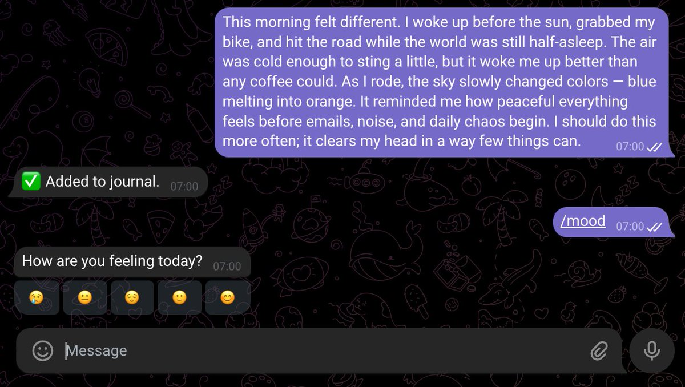
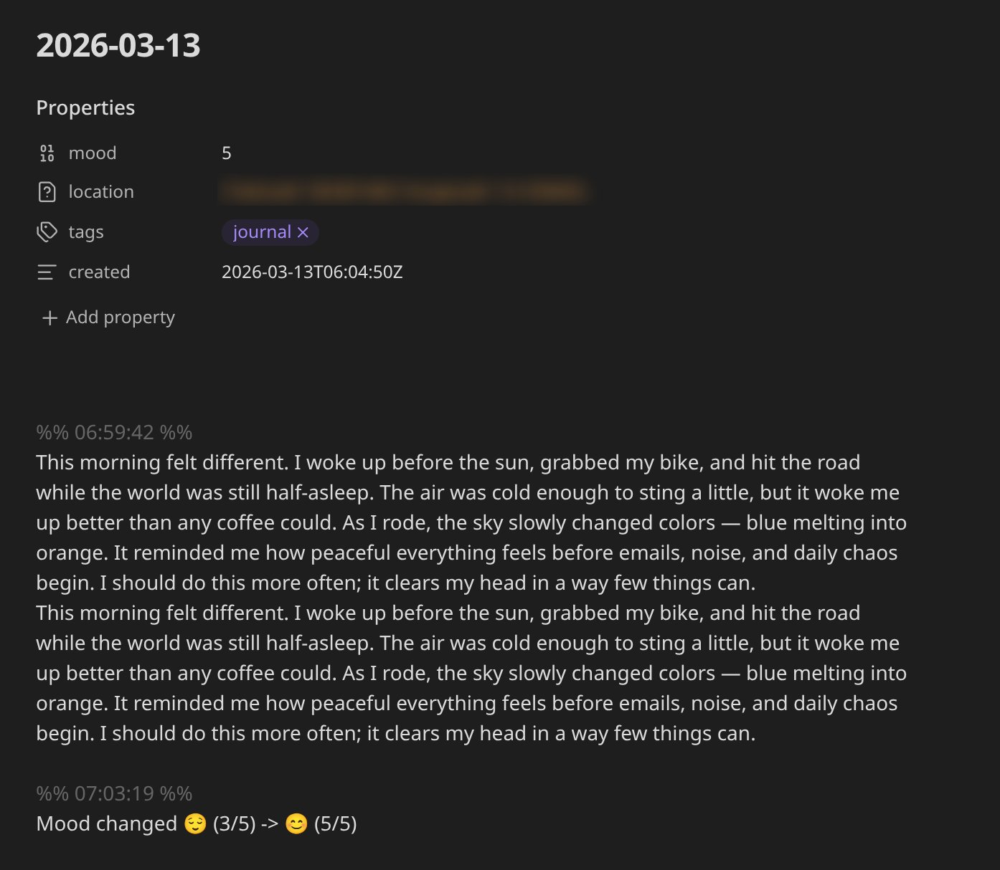

[](https://pypi.org/project/telejournal)
[](https://go.hugobatista.com/gh/telejournal/releases)
[](https://go.hugobatista.com/gh/telejournal/packages)
[](https://go.hugobatista.com/gh/telejournal/actions/workflows/test.yml)
[](https://go.hugobatista.com/gh/telejournal/actions/workflows/lint.yml)
# Telegram Journal Bot

**Capture thoughts on Telegram, persist them in Obsidian or GitHub, and never lose a moment again.**

Telejournal is a bot that journals every private message into daily markdown notes, persisting to either a local Obsidian vault or a GitHub repository. Designed for personal journaling and private note-taking with rich media support.

## Demo
User messages sent in a private chat are captured by the bot, including text and media.



Captured content is appended to your daily note with timestamped entries and structured formatting.



## Features

- Private chat journal capture for text, photos, voice recordings, video messages (including circular video notes), and locations
- UTC daily note partitioning at `YYYY/YYYY-MM-DD.md`
- Media storage (photos, voice, video) in `YYYY/attachments/`
- Pluggable storage providers:
  - `obsidian_vault` (filesystem)
  - `github_repo` (GitHub repository via REST API)
- YAML frontmatter management for `mood`, `tags`, and `created`
- In-memory state only (`context.chat_data` and `context.bot_data`)
- Date override commands (`/setdate`, `/resetdate`)
- Tags and mood management with inline keyboard callbacks
- `/show` asks whether to show note text only or rendered (text + embedded attachments)
- Displayed note timestamps are normalized from `%% HH:MM:SS %%` markers to `>HH:MM:SS` for cleaner chat output
- Daily UTC "on this day" brief sends a years summary and asks whether to show history as notes only or rendered
- Replies to historical bot messages can include a quote plus a clickable source-note link back to the original daily note
- Edited text messages update their original journal entry in place instead of creating a duplicate
- Guided `/settings` command for runtime updates of tag choices, daily brief time, mood prompt toggle, and bot menu visibility
- `/settings` updates are persisted to YAML so values survive bot restarts (existing config files are backed up before overwrite)

## Usage

### Installation

Choose one installation method:

From PyPI (recommended for end users):

```bash
python -m pip install --upgrade telejournal
```

From source (recommended for contributors):

```bash
git clone https://github.com/hugobatista/telejournal.git
cd telejournal
uv sync --extra dev
```

If running from source, use `uv run` before commands in the sections below.
Example: `uv run telejournal run --verbose`.

### Quick Start

1. Configure your environment variables as documented in `Environment`.

2. Start the bot:

```bash
telejournal run --verbose
```

3. Open your bot in Telegram and send:

```text
/help
```

4. Send a normal message (for example, `First journal entry`) and confirm it appears in:

```text
<STORAGE_ROOT>/YYYY/YYYY-MM-DD.md
```

### Run Modes

Use whichever configuration style best fits your setup.

Environment variables only:

```bash
telejournal run
```

YAML configuration file (`config.yaml` auto-detected if present):

```bash
telejournal run
telejournal run /path/to/config.yaml
```

CLI overrides (highest priority):

```bash
telejournal run \
  --telegram-token your_token \
  --storage-provider obsidian_vault \
  --obsidian-vault-root /path/to/vault \
  --allowed-user-ids 123456,987654 \
  --message-timestamp-window-seconds 60 \
  --daily-brief-time-utc 09:00 \
  --obsidian-vault-secure-file-permissions
```

GitHub storage provider example:

```bash
telejournal run \
  --telegram-token your_token \
  --storage-provider github_repo \
  --github-owner your-org \
  --github-repo your-journal-repo \
  --github-branch main \
  --github-batch-window-seconds 60 \
  --github-token ghp_or_github_pat_token \
  --allowed-user-ids 123456,987654
```

When using `github_repo`, note writes and media uploads are queued in-memory and
flushed in burst commits every `batch_window_seconds` (default: `60`). Bot
feedback remains immediate, while GitHub API traffic is reduced.

During shutdown, telejournal performs a best-effort final flush of queued
GitHub writes (for example, when receiving SIGTERM in container stop flows).

### Telegram Commands

After the bot is running, these commands are available in your private chat:

- `/help` Show bot usage summary
- `/setdate` Start a guided date selection flow
- `/setdate YYYY-MM-DD [HH:MM:SS]` Set target note date/time directly
- `/resetdate` Return to current day
- `/tags` Show tag buttons
- `/tags work kids` Add/select one or more tags
- `/mood` Open mood picker
- `/show` Show current effective day note and choose notes only or rendered output
- `/show YYYY-MM-DD` Show a specific day note and choose notes only or rendered output
- `/todayinhistory` Show same-day note years and choose notes only or rendered output
- `/delete` Delete last entry and show deleted content
- `/delete day [YYYY-MM-DD]` Delete full day note
- `/settings` Guided runtime configuration for `tag_choices`, `daily_brief_time_utc`, `prompt_for_mood_if_missing`, and `bot_menu_enabled`
  - Changes are persisted immediately.
  - If the bot started from a YAML config file, that file is backed up and updated.
  - If no YAML config was used, `./config.yaml` is created/updated.

### Helpful CLI Commands

```bash
telejournal version
telejournal help
```

### Using secret-tool

If you use Linux secret service (`secret-tool`), you can skip a local `.env`
and use [secret-tool-run](https://go.hugobatista.com/gh/secret-tool-run):

```bash
secret-tool-run telejournal run
```

## Environment

Create a `.env` file:

```env
TELEGRAM_TOKEN=your_bot_token
LOG_LEVEL=INFO
TELEGRAM_ALLOWED_USER_IDS=123456,987654
STORAGE_PROVIDER=obsidian_vault
STORAGE_OBSIDIAN_VAULT_ROOT=/path/to/obsidian/vault
```

### Optional Environment Variables

- `MESSAGE_TIMESTAMP_WINDOW_SECONDS` (default: `60`) - Messages within this window share the same timestamp
- `STORAGE_OBSIDIAN_VAULT_SECURE_FILE_PERMISSIONS` (default: `true`) - Set restrictive permissions (0o700/0o600) on vault directories and files for security. Applies only to `obsidian_vault` provider.
- `DAILY_BRIEF_TIME_UTC` (default: `09:00`) - Daily UTC time for historical same-day brief (`HH:MM` or `HH:MM:SS`). Set to `0` to disable.
- `TAG_CHOICES` (default: `family,health,love,hobby,other,finance,social`) - Comma-separated tag choices used by inline tag buttons.
- `PROMPT_FOR_MOOD_IF_MISSING` (default: `true`) - Enable/disable automatic mood prompts after entry writes and timer checks.
- `BOT_MENU_ENABLED` (default: `true`) - Enable/disable Telegram command menu publishing at startup. When disabled, the bot removes its command menu.
- GitHub provider variables:
  - `STORAGE_GITHUB_OWNER`
  - `STORAGE_GITHUB_REPO`
  - `STORAGE_GITHUB_BRANCH` (default: `main`)
  - `STORAGE_GITHUB_TOKEN` (required for `github_repo`)
  - `STORAGE_GITHUB_PATH_PREFIX` (optional)
  - `STORAGE_GITHUB_API_BASE_URL` (default: `https://api.github.com`)
  - `STORAGE_GITHUB_BATCH_WINDOW_SECONDS` (default: `60`)

For `github_repo`, use a fine-grained personal access token scoped to exactly one target repository, with `Contents` read/write permissions.

At startup, telejournal attempts to detect repository visibility and logs a warning if the configured repository is public.

For troubleshooting GitHub batching, set `LOG_LEVEL=DEBUG` to inspect queue and
flush activity (queue size, flush cycle, and retry logs).

## Configuration

The bot supports multiple configuration sources with a clear priority order:

### Configuration Priority (highest to lowest)

1. **CLI Arguments** - Command-line options override all other sources
2. **YAML File** - Configuration file specified via `config` argument
3. **Environment Variables** - Settings from `.env` file
4. **Defaults** - Built-in defaults for optional settings

Later sources override earlier ones. For example, if you specify `--telegram-token` on the command line, it will override the `TELEGRAM_TOKEN` environment variable.

### YAML Configuration

You can provide a `config.yaml` file for more organized configuration management. The bot automatically looks for `./config.yaml` if no config path is specified.

**Example `config.yaml`:**

```yaml
telegram_token: "${TELEGRAM_TOKEN}"  # Supports environment variable expansion
allowed_user_ids:
  - 123456
  - 987654
storage:
  provider: obsidian_vault # obsidian_vault or github_repo
  obsidian_vault:
    root: /path/to/obsidian/vault
    secure_file_permissions: true
  github_repo:
    owner: your-org
    repo: your-journal-repo
    branch: main
    token: "${STORAGE_GITHUB_TOKEN}"
    path_prefix: ""
    api_base_url: https://api.github.com
    batch_window_seconds: 60
log_level: INFO
message_timestamp_window_seconds: 60
daily_brief_time_utc: "0"
tag_choices: ["family", "health", "love", "hobby", "other", "finance", "social"]
prompt_for_mood_if_missing: true
bot_menu_enabled: true
```

**Configuration Keys:**

- `telegram_token` (required) - Your Telegram bot token
- `allowed_user_ids` (required) - List of Telegram user IDs that can use the bot
- `storage` (required) - Hierarchical storage provider configuration
  - `storage.provider` - `obsidian_vault` or `github_repo`
  - `storage.obsidian_vault.root` - Filesystem root for vault storage
  - `storage.obsidian_vault.secure_file_permissions` - Restrictive perms toggle for vault storage
  - `storage.github_repo.owner` - GitHub owner/org
  - `storage.github_repo.repo` - GitHub repo name
  - `storage.github_repo.branch` - Branch for writes (default `main`)
  - `storage.github_repo.token` - Fine-grained token scoped to the target repo with Contents read/write
  - `storage.github_repo.path_prefix` - Optional sub-folder inside the repository
  - `storage.github_repo.api_base_url` - API base URL (default `https://api.github.com`)
  - `storage.github_repo.batch_window_seconds` - In-memory queue flush window in seconds (default `60`)
- `log_level` (optional, default: `INFO`) - Logging level (DEBUG, INFO, WARNING, ERROR, CRITICAL)
- `message_timestamp_window_seconds` (optional, default: `60`) - Messages within this window share the same timestamp
- `daily_brief_time_utc` (optional, default: `09:00`) - Daily UTC time for the historical same-day brief (`HH:MM` or `HH:MM:SS`), or `0` to disable
- `tag_choices` (optional, default: `family,health,love,hobby,other,finance,social`) - List of inline tag button choices
- `prompt_for_mood_if_missing` (optional, default: `true`) - Enable/disable mood prompts when entries exist without mood
- `bot_menu_enabled` (optional, default: `true`) - Enable/disable Telegram command menu publishing at startup

**Environment Variable Expansion:**

YAML configuration supports `${VAR_NAME}` syntax for environment variable expansion:

```yaml
telegram_token: "${TELEGRAM_TOKEN}"
storage:
  provider: obsidian_vault
  obsidian_vault:
    root: "${STORAGE_OBSIDIAN_VAULT_ROOT}"
```

This allows you to keep sensitive values in environment variables while using a configuration file for other settings.

## Test

```bash
uv run pytest

# With full coverage and type checking
bash validate.sh
```

## Docker

You can run the bot in Docker using either `docker run` or `docker compose`.

### Using Docker Compose

1. Create a `.env.docker` file with your bot token and settings:

    ```env
    TELEGRAM_TOKEN=your_bot_token
    STORAGE_PROVIDER=obsidian_vault
    STORAGE_OBSIDIAN_VAULT_ROOT=/data
    LOG_LEVEL=INFO
    TELEGRAM_ALLOWED_USER_IDS=123456,987654
    STORAGE_OBSIDIAN_VAULT_SECURE_FILE_PERMISSIONS=false # This will avoid permission issues when running as non-root, but use with caution!
    ```

2. Create an `obsidian-journal` directory in the same location as your `docker-compose.yml` to serve as your vault, and set permissions so the container can write to it:

    ```bash
    mkdir obsidian-journal
    chmod 777 obsidian-journal # Use with caution, or set specific user/group permissions as needed
    ```

2. Start the container:

    ```bash
    docker compose up --build
    ```

This will mount your Obsidian vault from `./obsidian-journal` to `/data` inside the container.

On SELinux-enabled Linux distributions (for example Fedora/RHEL), make sure
the bind mount uses `:Z` in `docker-compose.yml`:

```yaml
volumes:
    - ./obsidian-journal:/data:Z
```

### Using Docker Run

1. Build the image:

    ```bash
    docker build -t telejournal:latest .
    ```

2. Run the container:

    ```bash
    docker run -d \
      --env-file .env.docker \
            -v "$PWD"/obsidian-journal:/data:Z \
      --name telejournal \
      telejournal:latest
    ```

This will start the bot in detached mode, using your local `.env.docker` file and mounting your Obsidian vault.

> **Note:** If you see `pull access denied for telejournal`, you must build the image first:
>
> ```bash
> docker build -t telejournal:latest .
> ```
> Then run the container as shown above.

For troubleshooting, check logs with:

```bash
docker logs telejournal
```

## Signalbackup-Tools HTML Import Utility

A utility is provided to convert HTML exports generated by [signalbackup-tools](https://github.com/bepaald/signalbackup-tools) to Obsidian-compatible Markdown, preserving timestamps, attachments, and replies. This is useful for importing Signal chat history into your journal vault.

### Usage

```bash
python tools/signalbackup-tool-import/html_to_markdown.py <input_html_file> <output_directory>
```

- `<input_html_file>`: Path to your HTML export from signalbackup-tools (e.g., `html/self.html`)
- `<output_directory>`: Directory where year folders and markdown files will be created

Example:

```bash
python tools/signalbackup-tool-import/html_to_markdown.py html/self.html obsidian-journal
```

This will create:
- Year folders (e.g., `2022/`, `2023/`) with daily markdown files
- An `attachments/` folder in each year for media files

See the script for more details and options.

## Running as a Systemd Service

To run the Telegram Journal Bot as a background service on Linux, you can use systemd. This ensures the bot starts on boot and restarts automatically if it fails.

### Automated Service File Generation (Recommended)

The `install-service` command generates the service file automatically with sensible defaults:

```bash
telejournal install-service
```

This will:
- Create the service file at `/etc/systemd/system/telejournal.service`
- Use your current user account
- Set working directory to `~/obsidian-journal`
- Use `.env` from your home directory
- Automatically detect the `telejournal` executable path

You can customize these defaults:

```bash
# Use custom paths and user
telejournal install-service \
  --user myuser \
  --working-directory /obsidian-journal \
  --environment-file /telejournal/.env \
  --execstart "/home/myuser/.venv/bin/telejournal run"

```

After running the command, follow the on-screen instructions to enable and start the service.

### Manual Service File Creation

Alternatively, you can manually create a service file at `/etc/systemd/system/telejournal.service` with the following content (adjust paths and user as needed):

```ini
[Unit]
Description=Telegram Journal Bot
After=network.target

[Service]
Type=simple
User=youruser
WorkingDirectory=/home/youruser/obsidian-journal
EnvironmentFile=/home/youruser/.env
ExecStart=/home/youruser/.venv/bin/telejournal run
Restart=on-failure
RestartSec=5

[Install]
WantedBy=multi-user.target
```

**Configuration details:**

- `User` - The user account that will run the bot (should own the vault directory)
- `WorkingDirectory` - Your Obsidian vault root directory (where notes are stored)
- `EnvironmentFile` - Path to your `.env` file with required environment variables
- `ExecStart` - Full path to the `telejournal` command (installed in your virtual environment)
- `RestartSec` - Wait 5 seconds before restarting on failure

If you installed `telejournal` system-wide via pip, you can use just `telejournal run` without the full path.

### Enable and Start the Service

```bash
sudo systemctl daemon-reload
sudo systemctl enable telejournal.service
sudo systemctl start telejournal.service
```

Check logs with:

```bash
journalctl -u telejournal.service -f
```

This will keep the bot running in the background and restart it automatically on failure or reboot.


